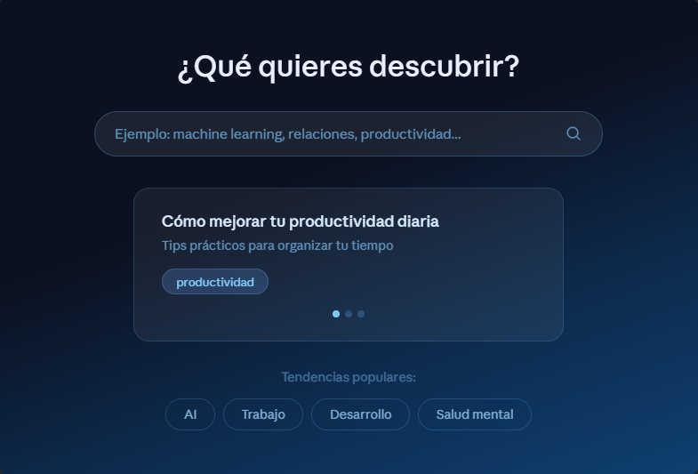
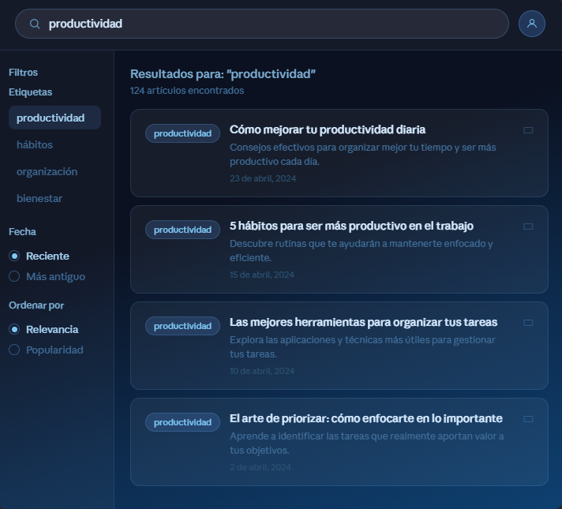
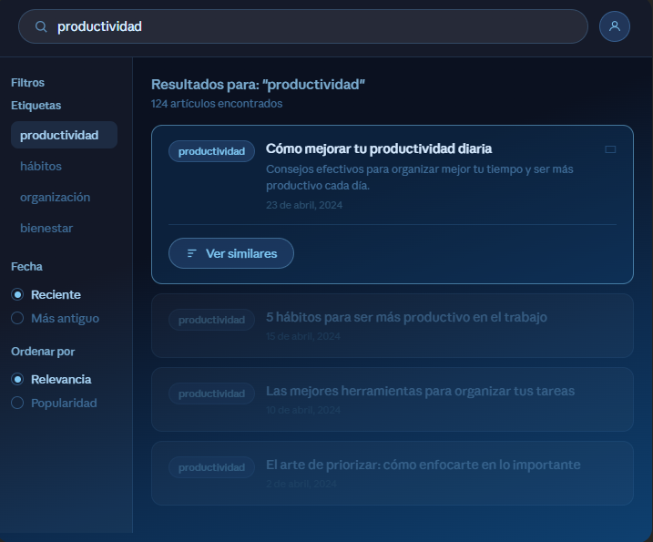
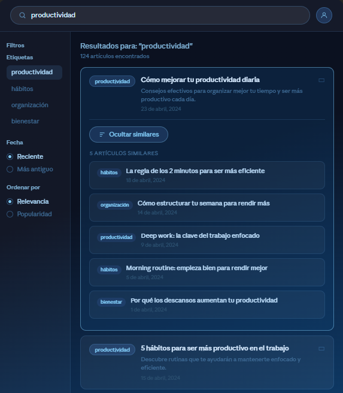

# 🚀 Proyecto Frontend - Buscador Inteligente de Artículos

<p align="center">
  
  
  
  
</p>

---

## 🧠 Descripción

Interfaz frontend para un sistema de búsqueda y recomendación de artículos basado en similitud (TF-IDF).
El objetivo es ofrecer una experiencia visual moderna e interactiva para explorar contenido.

---

## 🛠️ Tecnologías

| Área        | Tecnologías        |
| ----------- | ------------------ |
| 🎨 Frontend | JavaScript, React  |
| 🔌 API      | FastAPI            |
| 🧪 Testing  | PostgreSQL, Python |

---

## 🎯 Funcionalidades UI

---

### 🎞️ Card Slider Automático

<p align="center">
  
</p>

✨ Características:

* 🔄 Slider automático de artículos
* ⬅️ Posibilidad de retroceder manualmente
* 🔁 Contenido cambia en cada refresh
* 🚧 *Tendencias populares aún no implementadas*

---

### 📰 Listado de Artículos

<p align="center">
  
</p>

📌 Reglas:

* 🔢 Máximo **10 artículos por página**
* 📄 Paginación en el footer
* 🚧 Ignorar barra lateral izquierda (temporal)

---

### 🧩 Interacción con Cards

<p align="center">
  
</p>

🖱️ Comportamiento:

* Al seleccionar una card:

  * 🌑 Las demás se oscurecen
  * 🔘 Aparece botón **"Ver similares"**
* 🚧 Ignorar barra lateral izquierda

---

### 🔍 Recomendaciones de Similitud

<p align="center">
  
</p>

🤖 Funcionalidad:

* Mostrar **5 artículos más similares**
* 🌕 Las demás cards se aclaran para mejor visual
* 🚧 Ignorar barra lateral izquierda

---

## ⚠️ Consideraciones Importantes

> 🚫 Ignorar por ahora:

* Descripciones de artículos en las cards
* Icono de cuenta (esquina superior derecha)
* Barra lateral izquierda

---

## 📦 Setup del proyecto

```bash
# Clonar repositorio
git clone <repo-url>

# Instalar dependencias
npm install

# Ejecutar proyecto
npm run dev
```

---

## 📡 Conexión con Backend

El frontend consumirá endpoints desde FastAPI, por ejemplo:

```javascript
GET /search
GET /recommendations
GET /articles
```

---

## 🤝 Comunicación

📢 Cualquier duda, error o mejora:

> Por favor comunicarlo directamente para iterar rápidamente sobre el desarrollo.

---

<p align="center">
  💡 Proyecto en construcción — iteración continua
</p>

<p align="center">
  ✅ Crear base de datos en PostgreSQL
</p>

<pre>
Crear base de datos con el nombre: mediumdb

!No cambiar nombre de las tablas ni de la base de datos!

Crear las tablas usando el script SQL que esta en carpeta: postgresql
</pre>

<p align="center">
  ✅ Exportar datos a PostgreSQL desde psql
</p>

```bash
  
#Hacerlo por cada tabla usando los csv de la carpeta csv
\copy nombre_tabla FROM 'C:ubicacion/de_archivo.csv/en_sus/equipos' DELIMITER ',' CSV HEADER;
  
```

<p align="center">
 ✅ Instalar librerias en Python version 13.12.7
</p>

```bash
pip install -r requirements.txt
```

<p align="center">
  ✅ Script para correr el backend
</p>


```bash

# Crear entorno
python -m venv env

# Activar entorno
env\Scripts\activate

# Instalar dependencias
pip install -r requirements.txt

# Ejecutar API
uvicorn src.main:app --reload

```

